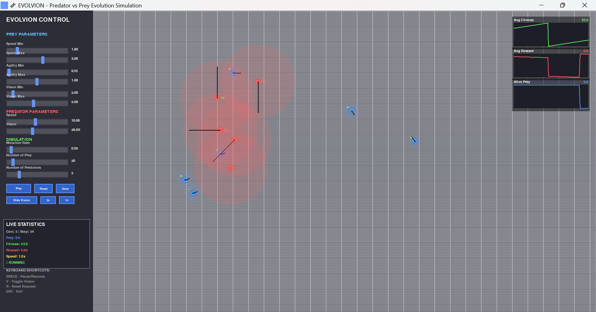

# 🧬 EVOLVION - Predator vs Prey Evolution Simulation

An AI-driven evolution simulation that models the interaction between predators and prey in a virtual environment. The project uses genetic algorithms for prey evolution and reinforcement learning (Q-Learning) for predator behavior.

## 📚 Table of Contents

- [Features](#-features)
- [How It Works](#-how-it-works)
  - [Prey Evolution](#prey-evolution)
  - [Predator Learning](#predator-learning)
  - [Simulation Environment](#simulation-environment)
- [Project Structure](#-project-structure)
- [Installation & Setup](#️-installation--setup)
  - [Prerequisites](#prerequisites)
  - [Running the Simulation](#running-the-simulation)
- [User Interface](#-user-interface)
  - [Control Panel](#control-panel)
  - [Live Statistics](#live-statistics)
  - [Visualization Options](#visualization-options)
- [Configuration](#-configuration)
- [Data Analysis](#-data-analysis)
  - [Generation Logs](#generation-logs)
  - [Visualizations](#visualizations)
  - [Example Analysis Functions](#example-analysis-functions)
- [Algorithm Details](#-algorithm-details)
  - [Genetic Algorithm](#genetic-algorithm)
  - [Q-Learning](#q-learning)
- [Extending the Project](#-extending-the-project)
  - [Adding New Agent Behaviors](#adding-new-agent-behaviors)
  - [Custom Fitness Functions](#custom-fitness-functions)
  - [New Analysis Methods](#new-analysis-methods)
- [Example Results](#-example-results)
- [Troubleshooting](#-troubleshooting)
  - [Common Issues](#common-issues)
  - [Performance Optimization](#performance-optimization)
- [License](#-license)
- [Contributing](#-contributing)
- [Further Reading](#-further-reading)
- [Authors](#-authors)

## 🌟 Features

- **Evolution Simulation**: Prey evolves through natural selection, crossover, and mutation
- **Reinforcement Learning**: Predators use Q-Learning to optimize hunting strategies
- **Interactive Visualization**: Real-time pygame-based UI with modern controls
- **Data Analysis**: K-means clustering and visualization of prey trait distributions
- **Performance Tracking**: Live charts showing fitness, rewards, and population dynamics
- **Configurable Parameters**: Real-time adjustment of simulation parameters via UI sliders
- **Comprehensive Logging**: Generation data stored in JSON format for analysis

## 🚀 How It Works

### Prey Evolution
- Prey agents have three main traits: **speed**, **agility**, and **vision**
- Each generation, prey with higher fitness (survival time) are more likely to reproduce
- Offspring inherit traits through crossover and random mutations
- Natural selection drives the evolution of better survival strategies

### Predator Learning
- Predators use Q-Learning to learn optimal hunting behaviors
- State representation includes grid position and direction to nearest prey
- Actions include movement in four directions or staying still
- Rewards are given for successful catches, with penalties for time spent hunting

### Simulation Environment
- Agents move in a 2D world with collision detection
- Vision systems allow agents to detect others within their sight range
- Real-time visualization shows agent movements, vision circles, and performance metrics

## 📁 Project Structure

```
├── analysis/
│   ├── clustering.py       # K-means clustering of prey traits
│   ├── logger.py           # Generation data logging system
│   └── visualization.py    # Data plotting and visualization
├── core/
│   ├── agent_base.py       # Base class for all agents
│   ├── environment.py      # Simulation environment management
│   ├── predator.py         # Predator agent with Q-Learning
│   └── prey.py             # Prey agent with evasion behavior
├── data/
│   ├── logs/               # JSON logs of each generation
│   └── plots/              # Generated analysis plots
├── logic/
│   ├── evolution.py        # Genetic algorithm implementation
│   ├── rl.py               # Q-Learning agent implementation
│   └── simulation.py       # Main simulation loop
├── ui/
│   ├── pygame_view.py      # Modern pygame visualization
│   └── ui_controller.py    # Interactive UI controls
├── config.py               # Simulation configuration
├── main.py                 # Application entry point
├── tests/
└── README.md
```

## 🛠️ Installation & Setup

### Prerequisites
- Python 3.8 or higher
- Required Python packages:

```bash
pip install pygame matplotlib numpy scikit-learn
```

### Running the Simulation

1. **Clone the repository**:
   ```bash
   git clone https://github.com/novelxv/Evolvion.git
   cd Evolvion
   ```

2. **Run the simulation**:
   ```bash
   python main.py
   ```

3. **Control the simulation**:
   - **SPACE**: Pause/Resume simulation
   - **V**: Toggle vision circles
   - **R**: Request reset
   - **ESC**: Exit simulation

## 🎮 User Interface



### Control Panel
The left sidebar provides real-time control over simulation parameters:

- **Prey Parameters**: Adjust speed, agility, and vision ranges
- **Predator Parameters**: Modify predator speed and vision
- **Simulation Settings**: Control mutation rate and population sizes
- **Playback Controls**: Pause, resume, and adjust simulation speed

### Live Statistics
- Current generation and step
- Alive prey count
- Average fitness and predator rewards
- Real-time performance charts

### Visualization Options
- Toggle vision circles for agents
- View collision detection in real-time
- Performance charts showing evolution progress

## 📊 Configuration

Key parameters in [`config.py`](config.py):

```python
CONFIG = {
    "num_generations": 15,           # Number of evolution cycles
    "num_prey": 20,                  # Initial prey population
    "num_predators": 5,              # Number of predators
    "time_steps_per_generation": 200, # Steps per generation
    
    # Prey trait ranges
    "trait_range": {
        "speed": (1.0, 3.0),
        "agility": (0.1, 1.0), 
        "vision": (2.0, 5.0)
    },
    
    # Evolution parameters
    "mutation_rate": 0.05,
    
    # Q-Learning parameters
    "rl": {
        "learning_rate": 0.2,
        "discount_factor": 0.9,
        "epsilon": 0.4
    }
}
```

## 📈 Data Analysis

The simulation generates several types of analysis:

### Generation Logs
Located in [`data/logs/`](data/logs/), each generation produces a JSON file containing:
- Prey traits and fitness values
- Predator reward accumulation
- Population statistics

### Visualizations
Generated in [`data/plots/`](data/plots/):
- Trait distribution histograms
- Cluster analysis of prey characteristics
- Predator reward curves over time

### Example Analysis Functions

- [`cluster_prey_traits()`](analysis/clustering.py): Groups prey by similar traits
- [`plot_reward_curve()`](analysis/visualization.py): Shows predator learning progress
- [`plot_trait_distribution()`](analysis/visualization.py): Visualizes trait evolution

## 🧠 Algorithm Details

### Genetic Algorithm ([`logic/evolution.py`](logic/evolution.py))
1. **Selection**: Fitness-proportionate selection of survivors
2. **Crossover**: Average traits from two parents
3. **Mutation**: Random trait modification based on mutation rate
4. **Replacement**: Generate new population for next generation

### Q-Learning ([`logic/rl.py`](logic/rl.py))
- **State Space**: Grid position + direction to nearest prey
- **Action Space**: {up, down, left, right, stay}
- **Reward Function**: +5.0 for catches, -0.001 per time step
- **Exploration**: ε-greedy policy with configurable epsilon

## 🔧 Extending the Project

### Adding New Agent Behaviors
Inherit from [`BaseAgent`](core/agent_base.py) and implement:
- `handle_movement()`: Define movement strategy
- `update()`: Custom update logic

### Custom Fitness Functions
Modify fitness calculation in [`Prey.update()`](core/prey.py):
```python
def update(self):
    if self.alive:
        self.fitness += custom_fitness_function()
    super().update()
```

### New Analysis Methods
Add visualization functions to [`analysis/visualization.py`](analysis/visualization.py) for custom metrics.

## 📋 Example Results

After running a simulation, you might observe:

- **Early Generations**: Random trait distribution, low predator success
- **Mid Generations**: Prey speed increases, predators learn basic hunting
- **Late Generations**: Optimized prey evasion strategies, expert predator behavior

## 🐛 Troubleshooting

### Common Issues
1. **Pygame display errors**: Ensure proper graphics drivers
2. **Performance issues**: Reduce population sizes or world size
3. **Import errors**: Verify all dependencies are installed

### Performance Optimization
- Adjust `time_steps_per_generation` for faster/slower evolution
- Modify `world_size` to balance detail vs. performance
- Use smaller populations for testing

## 📄 License

This project is licensed under the MIT License. See the [`LICENSE`](LICENSE) file for details.

## 🤝 Contributing

Contributions are welcome! Please feel free to submit issues, feature requests, or pull requests.

## 📚 Further Reading

- [Genetic Algorithms in Python](https://www.google.com/search?q=genetic+algorithms+python)
- [Reinforcement Learning with Q-Learning](https://www.google.com/search?q=q-learning+reinforcement+learning)
- [Pygame Documentation](https://www.pygame.org/docs/)
- [Evolutionary Computing](https://www.google.com/search?q=evolutionary+computing)

## 👥 Authors
Novelya Putri Ramadhani - [GitHub Profile](https://github.com/novelxv)

Hayya Zuhailii Kinasih - [GitHub Profile](https://github.com/hayyazk)

Syarafi Akmal - [GitHub Profile](https://github.com/SyarafiAkmal)

---

**Developed with ❤️ for computational evolution research**